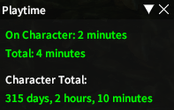
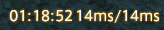

# BetterPlaytime

Provides expanded functionality to seamlessly track total playtime.  
Use /btime once on each character to add them.

+ Supports multiple characters,
+ Customisable output formats such as hours or minutes
+ Automatic playtime tracking after character got registered
+ Simple window to see current session playtime
+ Server Info Bar integration

## Session Playtime Window

## Server Bar
